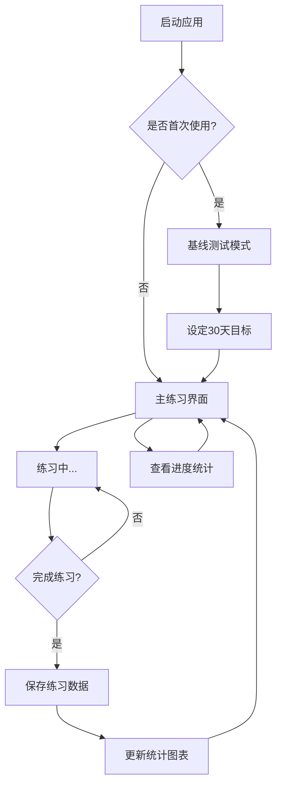

## 1. Product Overview
一个单页面打字练习应用，帮助用户在30天内从双拼（小鹤双拼）切换到86五笔输入法。通过渐进式目标设定、实时反馈和进度追踪，确保用户能够平滑过渡而不损失打字速度。

## 2. Core Features

### 2.1 User Roles
| Role | Registration Method | Core Permissions |
|------|---------------------|------------------|
| 练习用户 | 无需注册，本地使用 | 完整使用所有练习功能 |

### 2.2 Feature Module
应用包含以下核心功能模块：
1. **打字练习界面**：显示中文文本、五笔编码提示、实时反馈
2. **基线测试模式**：测试用户当前双拼输入速度
3. **进度统计面板**：每日WPM记录、目标曲线对比图表
4. **设置管理**：目标设定、练习配置

### 2.3 Page Details
| Page Name | Module Name | Feature description |
|-----------|-------------|---------------------|
| 主练习界面 | 文本显示区域 | 显示待输入的中文文本，自动过滤标点符号 |
| 主练习界面 | 五笔编码提示 | 为每个汉字显示对应的86五笔编码 |
| 主练习界面 | 实时反馈 | 输入时实时显示正确/错误状态，计算当前WPM |
| 主练习界面 | 练习控制 | 开始、暂停、重置练习会话 |
| 基线测试模式 | 双拼速度测试 | 专门测试用户当前双拼输入速度，作为30天目标基准 |
| 进度统计面板 | 每日统计 | 按日期展示每日练习数据、实际WPM与目标对比 |
| 进度统计面板 | 趋势图表 | 可视化展示30天练习进度曲线 |
| 设置管理 | 目标设定 | 设置30天后的目标WPM（基于基线测试结果） |
| 设置管理 | 练习配置 | 调整练习文本长度、难度等参数 |

## 3. Core Process
用户操作流程：
1. **首次使用**：进入基线测试模式，测试当前双拼WPM作为基准
2. **设定目标**：基于基线结果，系统自动计算30天内每日WPM目标
3. **日常练习**：进入主练习界面，根据提示输入中文文本
4. **进度查看**：随时查看统计面板了解练习进度和目标达成情况

## 4. User Interface Design

### 4.1 Design Style
- **主色调**：深绿色（#10B981）搭配浅灰色背景
- **按钮样式**：圆角矩形，悬停时有轻微阴影效果
- **字体**：中文使用思源黑体，英文数字使用Inter
- **布局风格**：卡片式布局，主要内容居中显示
- **图标风格**：使用简洁的线性图标

### 4.2 Page Design Overview
| Page Name | Module Name | UI Elements |
|-----------|-------------|-------------|
| 主练习界面 | 文本显示区 | 大字号（24px）中文文本，行高1.8，当前输入字符高亮显示 |
| 主练习界面 | 编码提示区 | 小字号（14px）灰色五笔编码，位于每个汉字下方 |
| 主练习界面 | 输入反馈区 | 实时WPM计数器，准确率百分比，进度条 |
| 主练习界面 | 控制按钮 | 绿色开始按钮，灰色暂停按钮，红色重置按钮 |
| 统计面板 | 图表区域 | 折线图显示30天WPM趋势，目标线为虚线 |
| 统计面板 | 数据卡片 | 今日WPM、目标达成率、总练习时长 |

### 4.3 Responsiveness
桌面优先设计，支持响应式布局。在移动设备上自动调整字体大小和布局结构，确保练习体验不受影响。触摸交互优化，按钮区域足够大便于点击。