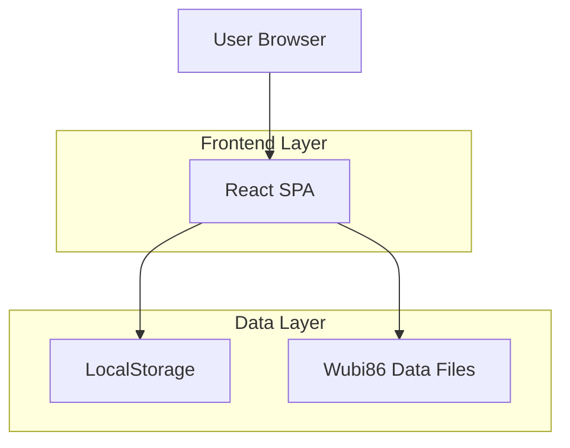
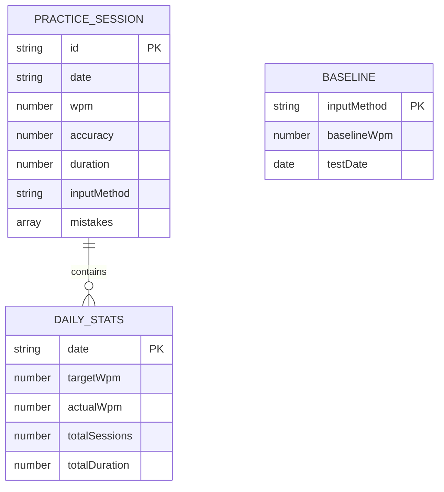

## 1.Architecture design



## 2.Technology Description

* Frontend: React\@18 + tailwindcss\@3 + vite

* Initialization Tool: vite-init

* Backend: None (纯前端应用)

* Data Storage: LocalStorage

## 3.Route definitions

| Route     | Purpose          |
| --------- | ---------------- |
| /         | 主练习界面，核心打字练习功能   |
| /baseline | 基线测试模式，测试双拼WPM   |
| /stats    | 进度统计面板，查看练习数据和图表 |
| /settings | 设置管理，配置目标和练习参数   |

## 4.Data model

### 4.1 Data model定义



### 4.2 LocalStorage数据结构

练习会话数据 (practice\_sessions)

```javascript
{
  "sessions": [
    {
      "id": "uuid",
      "date": "2026-03-09",
      "wpm": 25,
      "accuracy": 0.85,
      "duration": 300,
      "inputMethod": "wubi86",
      "mistakes": ["的", "是"]
    }
  ]
}
```

每日统计 (daily\_stats)

```javascript
{
  "dailyStats": {
    "2026-03-09": {
      "targetWpm": 20,
      "actualWpm": 25,
      "totalSessions": 3,
      "totalDuration": 900
    }
  }
}
```

基线数据 (baseline)

```javascript
{
  "baseline": {
    "shuangpin": {
      "wpm": 60,
      "testDate": "2026-03-09"
    }
  }
}
```

设置数据 (settings)

```javascript
{
  "settings": {
    "targetWpm": 60,
    "startDate": "2026-03-09",
    "endDate": "2026-04-08",
    "sessionLength": 300,
    "textDifficulty": "medium"
  }
}
```

## 5.五笔86数据文件结构

```javascript
// wubi86_mapping.json
{
  "的": "r",
  "是": "j",
  "中": "k",
  "国": "l",
  // ... 完整的汉字到五笔编码映射
}

// practice_texts.json
{
  "easy": ["中国人民", "我们学习", "天天向上"],
  "medium": ["科学技术是第一生产力", "实践是检验真理的唯一标准"],
  "hard": ["中华人民共和国成立于1949年", "改革开放改变了中国的命运"]
}
```

